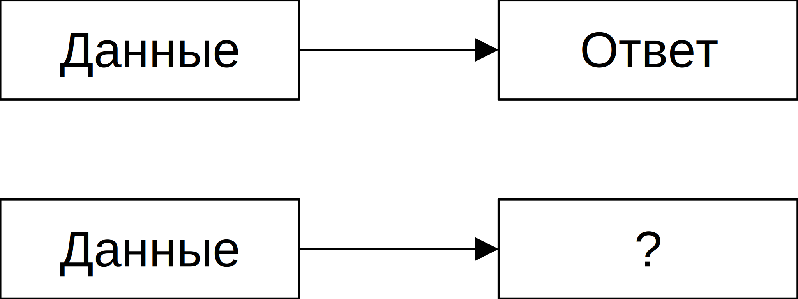

# Машинное обучение без учителя. Понижение размерности

Как сжать пространство признаков, чтобы оставить только самые важные данные и на их основе принять решение?

Классификация задач машинного обучения (от способа/метода решения)

- обучение с учителем
- обучение без учителя
- обучение с подкреплением

## Обучение с учителем

На входе есть некоторые данные, для которых известен ответ.

Есть новые данные, для которых требуется найти правило для определения ответа.

Есть некоторый набор ответов каждый из которых по своему близок к правильному, но скорее всего правильным не является, т.е. некоторая статистическая ошибка есть.

В обучении с учиталем выделяют две задачи:

- **задача регрессии**
- **задача классификации**

Они достаточно похожи, но только в задаче регрессии мы предсказываем некоторое числовое значение, а в задаче классификации ответ задан в виде ранга или к в виде категории, т.е. по факту он не числовое значение.

Мы можем задачу классификации приблизить к задаче регрессии, если расположим задачи по возрастанию и будем примерно предсказывать какой-то ранг.

Задачи тогда будут похожи и будут решаться одними и теми же алгоритмами, но принято их разделять, и говорить, что если мы предсказываем числовое значение, то это регрессия и у нее свои методы: 
- **линейная регрессия**, 
- **нелинейная регрессия**,
- **решающие деревья**

Если задача классификации, то методы
- **ближайщих соседей**,
- ...

Может быть множественная классификация.

У нас есть данные и есть ответ. Мы на них обучаем модель. Далее по новым данным эта модель что-то предсказывает, что-то достаточно близкое к ответу. В зависимости от объема данных, которые мы используем для обучения.

## Обучение без учителя

У нас нет правильного ответа. Есть только данные.

Возникают задачи:
- **кластеризации** - разделение данных базируется на количестве кластеров, удаленности от центров, ...
- **понижение размерности** - есть огромное количество признаков и мы хотим их уменьшить
  
Если в задаче обучения с учителем очень много входных данных, то мы сначала на разных параметрах применяем обучение без учителя, так как мы не знаем какие параметры важны, а какие нет. Можно ли снизить размерность

- **поиск аномалий** - задача фрода. Пытается ли кто-то обмануть систему или нет?

## Обучение с подкреплением

Обучение с подкреплением предполагает, что у нас нет данных, как таковых, а есть среда, которая генерирует ним поток сигналов и нужно принимать решения на основе этих сигналов. Отличие от других методов состоит в наличии обратной связи от среды, т.е. мы будем знать является ли ответ правильным или нет.

Их всех видов задач, задача обучения без учителя наиболее сложная, так как отсутствует целевая переменная.
